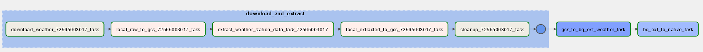
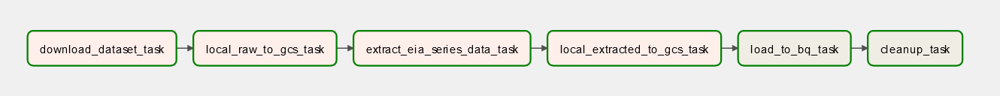
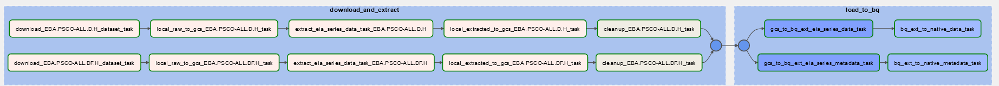
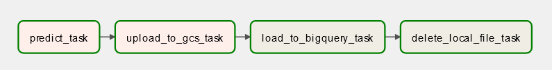

# Batch Processing With Airflow

I used Apache Airflow to create and orchestrate the pipeline that extracts and loads the data to the data lakes and the data warehouse and to batch deploy model predictions.

## Ingest Historical Weather Data DAG
[dags/ingest_historical_weather_data_dag.py](./dags/ingest_historical_weather_data_dag.py)

## Ingest Live Hourly Weather DAG
[dags/ingest_live_hourly_weather_dag.py](./dags/ingest_live_hourly_weather_dag.py)

## Ingest Raw Electricity DAG
[dags/ingest_raw_electricity_data_dag.py](./dags/ingest_raw_electricity_data_dag.py)

## Ingest Weather Forecast DAG
[dags/ingest_weather_forecast_dag.py](./dags/ingest_weather_forecast_dag.py)

## Batch Deploy Model Predictions DAG
[dags/batch_predict_dag.py](./dags/batch_predict_dag.py)

