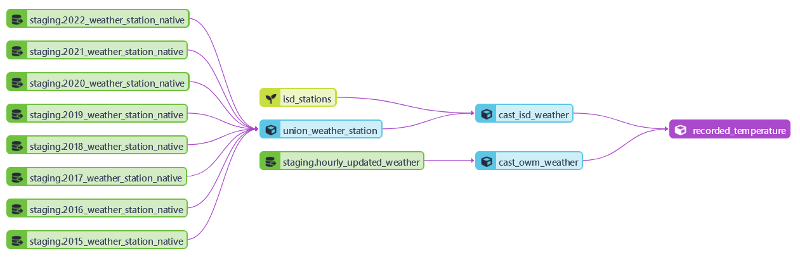

# dbt Tranformation in the Warehouse

Tables within the data warehouse were optimized by not partitioning or clustering. Tables less than 1GB should not be clustered or partitioned due to the overhead created, and my fact tables are under 1GB.

Look inside the [models directory](03_dbt/models) to see the transformations I applied with dbt.

# dbt transformation model for temperature data
[models/core/recorded_temperature.sql](./models/core/recorded_temperature.sql)

# dbt transformation for actual energy demand
[models/core/fact_eia_demand_historical.sql](./models/core/fact_eia_demand_historical.sql)

# dbt transformation for forecasted energy demand
[models/core/fact_eia_demand_forecast.sql](./models/core/fact_eia_demand_forecast.sql)

# dbt transformation for model monitoring
[models/core/ml_model_metrics.sql](./models/core/ml_model_metrics.sql)

Because the predictions from the batch deployed models are stored in the data warehouse, and the actual hourly data will be loaded and transformed the following day, I created a sql view with dbt to calculate the model metrics on the previous day's predictions.

