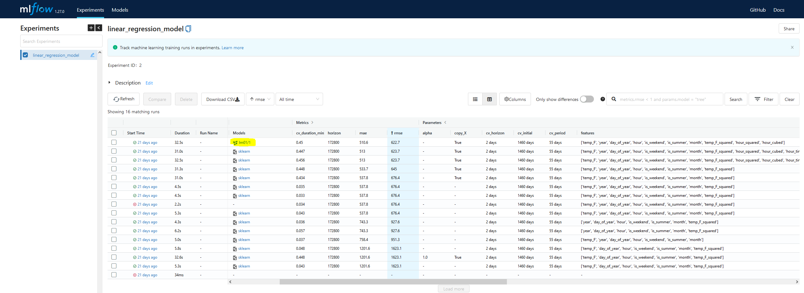
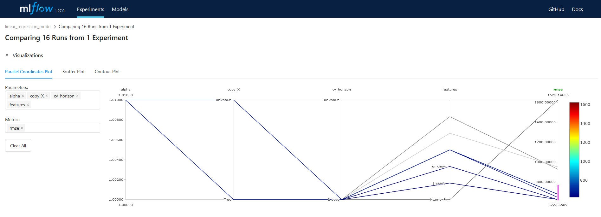

# Model Training, Experiment Tracking, and Registration with MLFlow

The purpose of this project was to build an MLOps framework for model development, deployment, and monitoring, not to develop the best model. So with that in mind, I did not spend as much time as I would have liked on perfecting the model. Hopefully I will have time to come back and improve the model in the future. 

## Setting up the MLFlow Tracking Server

Even though I am working on this project by myself, I wanted to go through the process of setting up the MLFlow tracking server and artifact storage as if I were on a team of data scientists and ML engineers. I modified this [excellent explanation](https://kargarisaac.github.io/blog/mlops/jupyter/2022/06/15/MLFlow-on-GCP.html) from Issac Kargar to dockerize and deploy the MLFlow on my GCP project. The tracking server is running on a virtual machine, the backend store is on a CloudSQL Postgres instance, and the artifact storage is in a GCS bucket. More information on the setup can be found in the [steps to recreate project](../steps_to_recreate_project) section of this repo.

## Model Experiment Tracking
The extent of the experimentation for the modeling was very simple, but it serves to demonstrate the capabilities of MLFlow very well. I trained a linear model based on the recorded temperature data and some time series feature engineering. Then I recorded experiment runs with various features and interaction terms, and logged the model to MLFlow. The image below shows some of the model runs sorted by cross validation rmse. The model with the lowest rmse was trained on the following features: 

['temp_F', 'year', 'day_of_year', 'hour', 'is_weekend', 'is_summer', 'month', 'temp_F_squared', 'hour_squared', 'hour_cubed']

## Model Experiment Comparison

MLFlow has some very useful features for comparing experiments. I wasn't able to take advantage of them for this project, since the I did not tune and optimize hyperparameters, but I can see how useful these interactive visualization would be to understand how various combinations of parameters and hyperparameters affect model experiments.

For example see the interactive parallel coordinate plot below.

## Model Registration
You can see that based on the highlighted symbol in the "Model" column of the above table, that the best model was logged to the MLFlow model registry so it can be batch deployed using Airflow.

