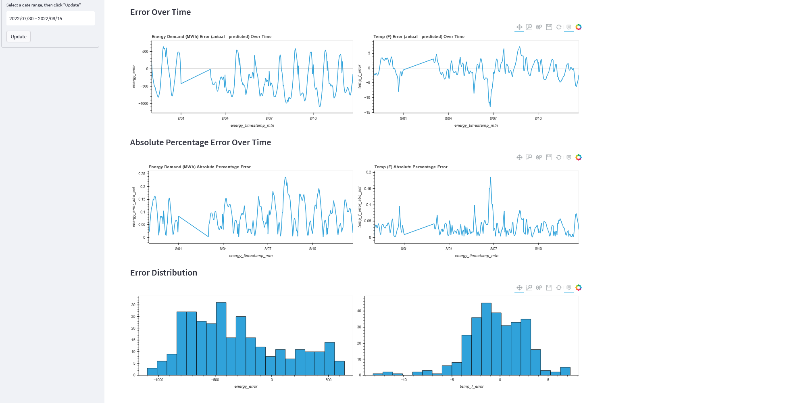

# Model Performance Monitoring

## Metrics calculation with dbt in the Warehouse
I took a batch monitoring approach for this project. As described in the previous section, the model is batch deployed on a daily basis using Airflow to predict the next day's hourly energy demand. Those predictions are loaded into the data warehouse. 

The data pipeline is also updating actual recorded energy demand and temperature on an hourly basis. Since all of that data is in the warehouse too, I created a [sql model in dbt](../03_dbt/models/core/ml_model_metrics.sql) to compute metrics on each prediction as soon as the actual data is loaded and transformed.

## Model Performance Dashboard
To visualize the model performance, I created a dashboard using Streamlit that reads the calculated metric data from the warehouse.

[LINK TO DASHBOARD](https://mharty3-energy-data-capstone-07-monitoringapp-o8dnn1.streamlitapp.com/)

### Dashboard Screenshots

