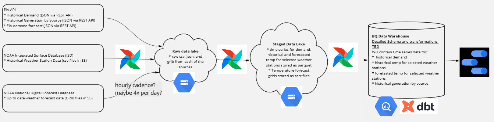

## Course Project Proposal

The goal of this project is to apply everything I learned
in this course to build an end-to-end data pipeline.

Deadlines:

* Submitting the project: 28 March, 22:00 CET
* Peer reviewing: 4 April, 22:00 CET

## Objective

This project will create the necessary data engineering infrastructure (an "end-to-end data pipeline") to evaluate trends in electricity demand in the Front Range of Colorado, USA.

Loading historical demand data along with historical temperature records will allow data scientists to develop reliable demand forecasts. I will also load the existing demand forecast from the EIA for baseline comparisons.

Accurately forecasting energy demand is critical for electrical grid operators. Without significant power storage options, electricity must be used at the time it is generated. Balancing authorities must have an accurate power demand forecast in order to successfully plan generation and interchange over the upcoming day(s). As the shift to renewables accelerates, this will only become more important because renewables are often more intermittent than traditional generation sources of power.

## Technologies 

* Cloud: GCP (some data sources will be extracted from AWS)
* Infrastructure as code (IaC): Terraform and Docker
* Workflow orchestration: Airflow
* Data Lake: GCS
* Data Warehouse: BigQuery
* Batch processing: probably dbt

## Data Sources

Multiple data sources of varying types will feed the pipeline.

* **Historical Energy Demand**: US EIA via REST API [link](https://www.eia.gov/opendata/)
* **Historical Weather Records**: US NOAA via csv files hosted in a public AWS S3 Bucket [link](https://registry.opendata.aws/noaa-isd/)
* **Temperature Forecast Data**: US NOAA via GRIB files hosted in a public AWS S3 Bucket [link](https://registry.opendata.aws/noaa-ndfd/)

## Data Pipeline

The cadence of the pipeline is still TBD. It will be scheduled to run at least daily, perhaps even hourly.

1. Extract data from various sources and save raw data to the data lake
2. Transform raw data to cloud optimized storage formats (parquet and zarr)
3. Load timeseries data to the data warehouse (will need more research for optimized timeseries storage and processing)
3. Transform (with dbt) as needed to join historical datasets with forecasted datasets and set up efficient time groupbys
4. Visualize in Google Cloud Studio

## Dashboard Concept

