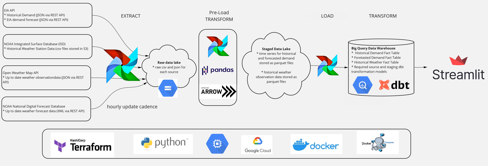
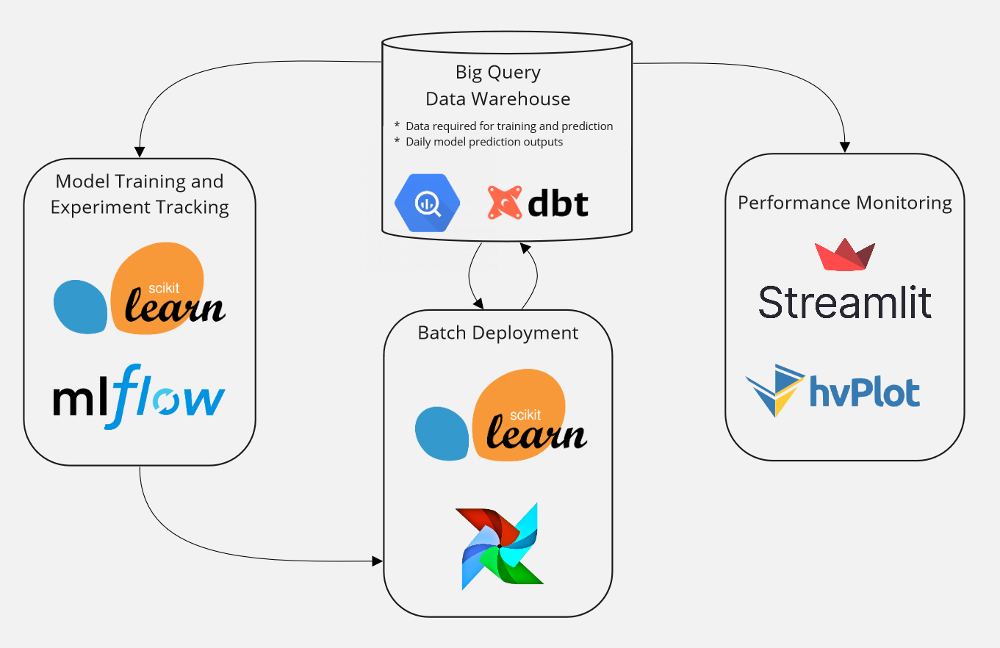
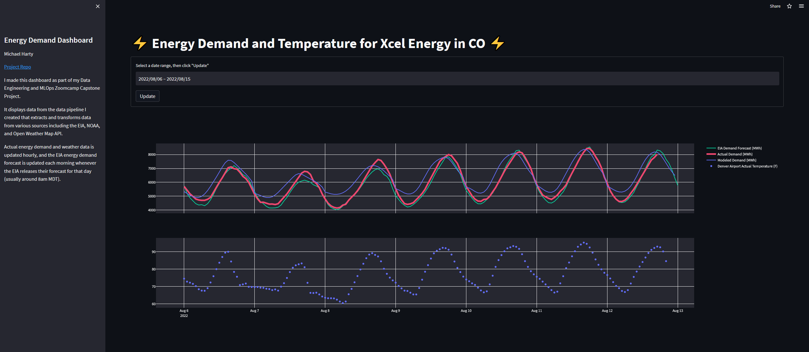
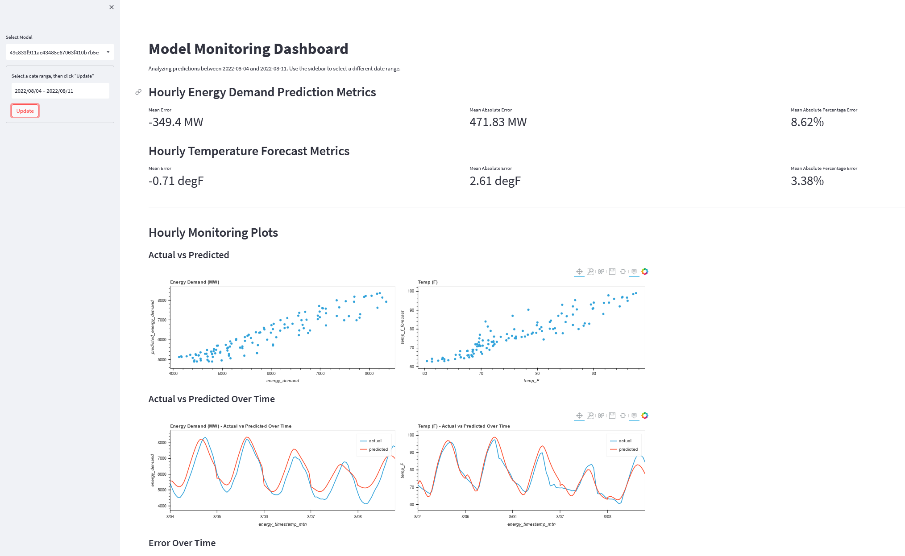

# Capstone Project for Data Engineering Zoomcamp and MLOps Zoomcamp

This is my capstone project for both the Data Engineering Zoomcamp and the MLOps Zoomcamp from Data Talks Club.  Course work and notes for the DE Zoomcamp are in [this other repo](https://github.com/mharty3/data_engineering_zoomcamp_2022).

## Objective
With few exceptions, electricity must be generated at the same time it is needed. This creates a challenge for electrical grid operators who have to make a plan to generate the electricity their customers need each hour. Accurately forecasting energy demand is critical for grid operators so they can appropriately plan to meet the generation needs of their customers.

This project utilizes Data Engineering and Machine Learning Operations (MLOps) concepts to build a system for forecasting hourly electricity demand in my region of Colorado. Implementing the project demonstrates the data skills I learned in the Data Talks Club's Zoomcamps. 

### Data Engineering
I applied data engineering and EtLT concepts from the modern data stack including workflow orchestration with Airflow, cloud data warehousing and data lake storage on Google Cloud, and data transformation with dbt. I used these concepts and tools to build a data pipeline that populates a Big Query data warehouse with the data a data scientist needs to make develop an hourly day-ahead demand forecast. 

### MLOps
Once the data pipeline was running, I used concepts and tools from MLOps to build a system for developing, deploying, and monitoring machine learning models that predict hourly energy demand. I used experiment tracking and model registration with MLFlow, batch model deployment with Airflow, and model monitoring with dbt and Streamlit.

## High level requirements

* The system should allow users to access historical electricity demand, EIA demand forecasts, historical weather data, and up-to-date weather forecast data in a Big Query data warehouse
* The scope will be limited to the Public Service Company of Colorado Balancing Authority (aka Xcel Energy)
* There should be an interactive dashboard to interact and visualize the data that is being loaded into the data warehouse
* An MLFlow tracking server, artifact storage, and model registry should be used to track the models that are being developed and deployed
* Production models should be deployed from the model registry to Airflow for batch model deployment
* Model performance metrics should be tracked and visualized in a dashboard

## Data Sources
Notebooks exploring each of these data sources can be found [here](00_data_source_exploration)

* Electricity Demand and Generation - [EIA Open Data](https://www.eia.gov/opendata/)
  * The United States Energy Information Administration (EIA) provides open access to hundreds of thousands of time series datasets via a REST API. The data is in the public domain, and requires [registraton and an API key](https://www.eia.gov/opendata/register.php).

* Historical Weather Data - [NOAA Integrated Surface Data](https://registry.opendata.aws/noaa-isd/)
  * The United States National Oceanic and Atmospheric Administration (NOAA) maintins the Integrated Surface Database (ISD) with global hourly weather station observations from nearly 30,000 stations. The data is available in csv format in open AWS S3 bucket.

* Live weather data - [Open Weather Map API](https://openweathermap.org/)
  * Live weather observation data for anywhere on the globe is available for free (with certain API call limits) via the Open Weather Map REST API.

* Weather Forecast Data - [NOAA National Digital Forecast Database](https://registry.opendata.aws/noaa-ndfd/)
  * NOAA maintains the National Digital Forecast Database (NDFD) which is a suite of gridded forecasts of weather conditions for the United States. The data is available in gridded format in an open AWS S3 bucket or via XML from a REST API.

## Technologies and Tools
- Cloud - [**Google Cloud Platform**](https://cloud.google.com)
- Infrastructure as Code - [**Terraform**](https://www.terraform.io)
- Containerization - [**Docker**](https://www.docker.com) and [**Docker Compose**](https://docs.docker.com/compose/)
- Workflow Orchestration - [**Airflow**](https://airflow.apache.org)
- Pre-Load Transformation - [**pandas**](https://pandas.pydata.org/) and [**pyarrow**](https://arrow.apache.org/docs/python/index.html)
- Data Lake - [**Google Cloud Storage**](https://cloud.google.com/storage)
- Data Warehouse - [**BigQuery**](https://cloud.google.com/bigquery)
- Post-Load Transformation - [**dbt**](https://www.getdbt.com)
- Data Visualization/Dashboard - [**Streamlit**](https://streamlit.io/) and [**Plotly Express**](https://plotly.com/python/plotly-express/) and [**hvplot**](https://hvplot.holoviz.org/)
- Model Development, Experiment Tracking, and Registration - [**scikit-learn**](https://scikit-learn.org/) and [**MLflow**](https://www.mlflow.org/)
- Model Deployment - Batch Deployment with [**Airflow**](https://airflow.apache.org)
- Model Monitoring - [**dbt**](https://www.getdbt.com) and [**Streamlit**](https://streamlit.io/)

## Data and Forecast Dashboard
[Link](https://share.streamlit.io/mharty3/energy_data_capstone/04_dashboard/app.py)

Note: I am running low on free GCP credits, so by the time you read this, the apps may no longer work.

## Monitoring Dashboard
[Link](https://mharty3-energy-data-capstone-07-monitoringapp-o8dnn1.streamlitapp.com/)

