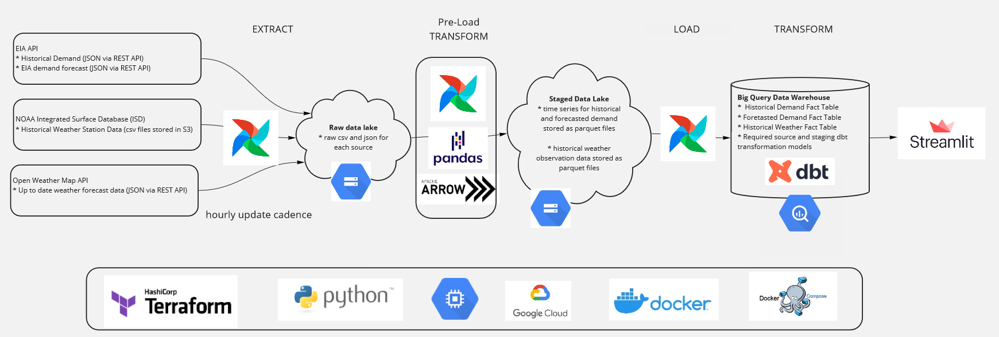

# Data Engineering Zoomcamp Capstone Project

This is the repo for my capstone project for the Data Engineering Zoomcamp from Data Talks Club. All of my course work and notes for the zoomcamp are in [this other repo](https://github.com/mharty3/data_engineering_zoomcamp_2022).

[Link to live dashboard](https://share.streamlit.io/mharty3/energy_data_exploration/04_dashboard/app.py)

## Objective

This project creates the necessary data engineering infrastructure to evaluate trends in electricty demand in Colorado and develop an hourly day-ahead demand forecast. Accurately forecasting energy demand is critical for electrical grid operators. 

Without significant power storage options, electricity must be used at the time it is generated. Balancing authorities must have an accurate power demand forecast in order to successfully plan generation and interchange over the upcoming days.

Loading historical demand data and historical temperature records into a database/data warehouse will provide data scientists with a reliable source of data to develop demand forecasts.

A data engineering project is more than an ad hoc analysis. It is building a robust system for data collection, ingestion, and transformation in order to create stable, evergreen datasets. Data scientists and analysts will rely on these datasets to be accurate, high quality, and up-to-date, so they can use them for business or research decisions.

## High level requirements

* The tool should allow users to access historical electricity demand, EIA demand forecasts, historical weather data, and up-to-date weather forecast data in a Big Query data warehouse
* Initially the scope will be limited to the Public Service Company of Colorado Balancing Authority (aka Xcel Energy)
* There should be an interactive dashboard to interact and visualize the data and any models that have been trained on the data

## Data Sources
Notebooks exploring each of these data sources can be found [here](00_data_source_exploration)

* Electricity Demand and Generation - [EIA Open Data](https://www.eia.gov/opendata/)
  * The United States Energy Information Agency (EIA) provides open access to hundreds of thousands of time series datasets via a REST API. The data is in the public domain, and requires [registraton and an API key](https://www.eia.gov/opendata/register.php).

* Historical Weather Data - [NOAA Integrated Surface Data](https://registry.opendata.aws/noaa-isd/)
  * The United States National Oceanic and Atmospheric Administration (NOAA) maintins the Integrated Surface Database (ISD) with global hourly weather station observations from nearly 30,000 stations. The data is available in csv format in open AWS S3 bucket.

* Live weather data - [Open Weather Map API](https://openweathermap.org/)
  * Live weather observation data for anywhere on the globe is available for free (with certain API call limits) via the Open Weather Map API.

* Weather Forecast Data - [NOAA National Digigal Forcast Database](https://registry.opendata.aws/noaa-ndfd/)
  * Note: this is not part of the pipeline yet, but will be requried to deploy any trained models.

## Technologies and Tools
- Cloud - [**Google Cloud Platform**](https://cloud.google.com)
- Infrastructure as Code - [**Terraform**](https://www.terraform.io)
- Containerization - [**Docker**](https://www.docker.com) and [**Docker Compose**](https://docs.docker.com/compose/)
- Workflow Orchestration - [**Airflow**](https://airflow.apache.org)
- Pre-Load Transformation - [**pandas**](https://pandas.pydata.org/) and [**pyarrow**](https://arrow.apache.org/docs/python/index.html)
- Data Lake - [**Google Cloud Storage**](https://cloud.google.com/storage)
- Data Warehouse - [**BigQuery**](https://cloud.google.com/bigquery)
- Post-Load Transformation - [**dbt**](https://www.getdbt.com)
- Data Visualization/Dashboard - [**Streamlit**](https://streamlit.io/) and [**Plotly Express**](https://plotly.com/python/plotly-express/)

## Architecture

## Dashboard

