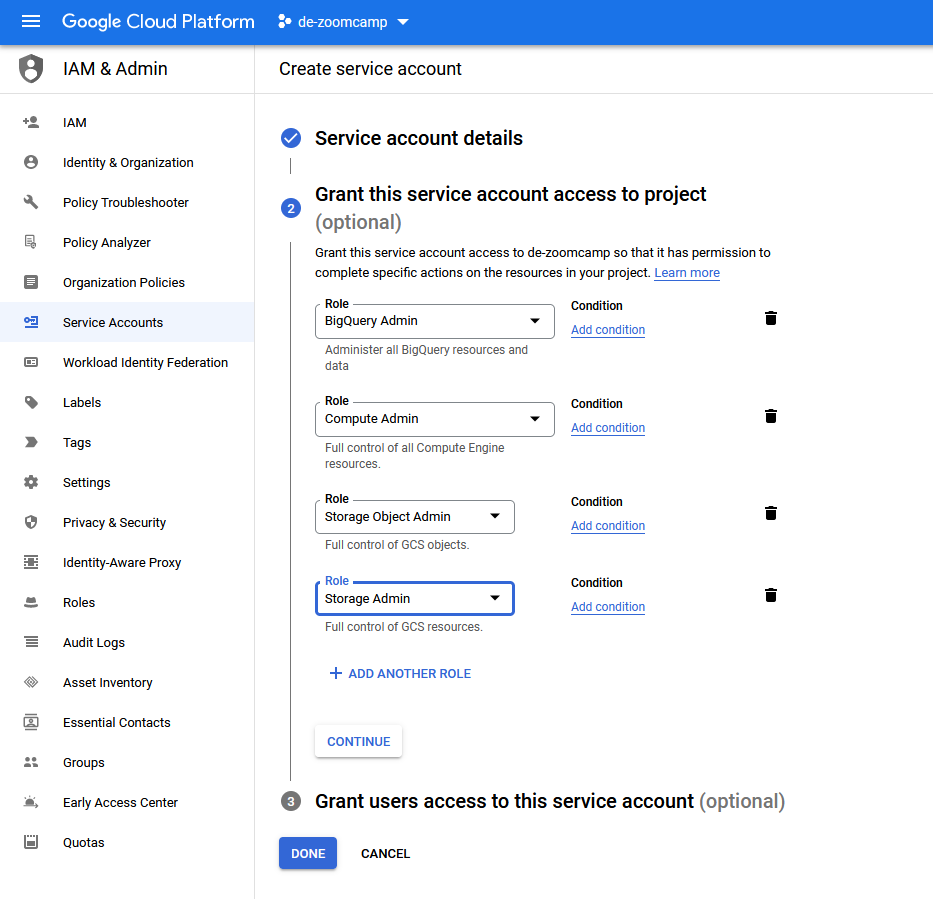
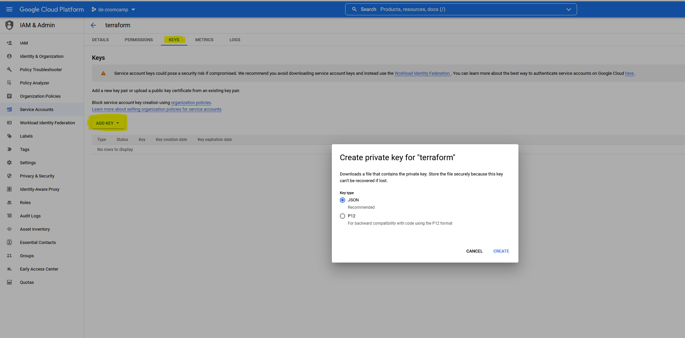
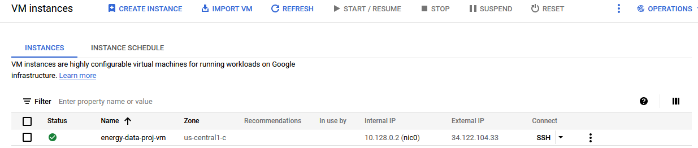

# Steps to recreate project

## Provision Cloud Infrastructure
This section will walk you through how to use the existing terraform configuration files to create a Big Query instance, a GCS storage bucket, and a Google Cloud Compute Engine Instance (virtual machine). Then it will walk through configuring the compute instance to be ready to use. 

1. Create a new project on google cloud platform

2. Set up IAM (Identity and Access Management) for a Service Account. Grant this account **Storage Admin** + **Storage Object Admin** + **BigQuery Admin** + **Compute Admin** privileges. This service account will be used by terraform to provision the infrastructure for the project.



3. Create and download a json key for credentials. Store the file in `~/.config/gcloud`
   Create an environment variable with the path to the credentials json. This will be used by terraform to access GCP.

   ```bash
   export GOOGLE_APPLICATION_CREDENTIALS="path/to/credentials.json"
   ```



4. On GCP, enable the Compute Engine API

4. Create an ssh key that will be used to connect the the VM. Update the value of the `metadata: ssh_public_key` variable in the `variables.tf` file with the path to the public key.

    ```bash
    ssh-keygen -t rsa -f ~/.ssh/<name_of_credential> -C <user-name> -b 2048
    ```

5. Use terraform to provision the infrastructure. Terraform will prompt you to enter the project id from GCP. If you have used terraform in this directory in a different project, you may need to create a new terraform workspace.

   ```bash
   terraform workspace new <workspace-name>
   ```

    ```bash
    cd 01_terraform
    terraform init
    terraform plan
    terraform apply
    ```

Now we can see that the infrastructure has been created on GCP. For example, the VM instance: 




5. Configure local ssh to connect to the vm. 

    On Linux (or WSL in my case) create or modify a file called `~/.ssh/config` to contain the following block of text:

        ```
        Host energy-vm
            HostName <external IP of Compute instance>
            User <username>
            IdentityFile <path to ssh private key created above. something like ~/.ssh/gcp2 >
        ```
    
    For windows you will want to add the same text to the windows ssh config located in 
    
    `/mnt/c/Users/<username>/.ssh/config`
    
    Double check the path to the private key, you may need to copy it to the windows side from WSL.

6. Now connect to the vm from the terminal with `ssh energy-vm`

7. In order to authenticate with GitHub, you will need to create a new ssh key and add it to GitHub. Generate the key with the command: 

    ```bash
    ssh-keygen -t rsa -f ~/.ssh/id_rsa -b 4096
    ```

    On GitHub, go to settings, ssh keys, and click New SSH Key. Paste in the contents of the file `~/.ssh/id_rsa.pub` into the textbox. 

7. Git clone this repo using ssh

    ```bash
    git clone git@github.com:mharty3/energy_data_capstone.git
    ```

8. Set up git identity: 
    
    ```bash
    git config --global user.email <email>
    git config --global user.name <username>
    ```

8. Run the bash setup script and the below commands to install `oh-my-fish` shell and install the theme that I like. 
    
    ```bash
     bash energy_data_capstone/01_terraform/vm_init.sh
     curl https://raw.githubusercontent.com/oh-my-fish/oh-my-fish/master/bin/install | fish
     omf install agnoster
     conda intit fish
     ```

9. Disconnect and re-connect from the VM via SSH and it will be all set up! Remember that if you shut down and restart the VM, the IP will probably change and you will need to update your local ssh config files accordingly.

### Useful links for GCP and Terraform: 

* https://cloud.google.com/community/tutorials/getting-started-on-gcp-with-terraform

* https://stackoverflow.com/questions/62638916/how-to-provide-image-name-in-gcp-terraform-script

## Set up airflow

1. Create a file in `02_airflow` called `.env`. Add the following variables:

    ```
    AIRFLOW_UID=50000
    EIA_KEY=<api key for the eia>
    OWM_KEY=<api key for open weather map>
    ```

2. Update the values for the variables `GCP_PROJECT_ID` and `GCP_GCS_BUCKET` in `docker-compose.yml` with the new values for the new project id

3. Copy the google credentials json file created above (it was saved in `~/.config/gcloud` on the local machine) to the vm using scp. Note this command is run in the terminal on the local machine, and `<energy-vm>` should be whatever the remote host is named in the `~/.ssh/config` file.

    ```bash
    scp <local path to credentials> <energy-vm>:~/.google/credentials/google_credentials.json 
    ```


4. cd into into `02_airflow` and run:
    
    ```
    docker-compose up airflow-init
    docker-compose up
    ```

5. Forward the port `8080` from the VM to the local machine to access the web interface at `http://localhost:8080/home`


6. Before activating the dags, it is convenient to set the `ingest_historical_weather_data_dag` to a yearly interval for a quicker backfill. Once it has caught up to the previous year, adjust the `end-date` to several days into the future, and change the interval back to daily. There is typically a lag of several days before observations are added to the historical data source, so this will allow the dag to pull the updated observations as they are added to the file. 

7. Activate the dags, and the runs will begin populating the data lake and data warehouse.

## dbt

1. Sign into dbt cloud

2. Update BigQuery Connection Credentials: Click on the top left hamburger, and go to Account Settings. Select the energy_data project, edit the connection information by uploading the credentials JSON file from google cloud. 

3. Update the schema with the new database name: From the top left, hamburger menu, click Develop. Then navigate to `03_dbt/models/core/schmea.yml`. Update the database under sourced to have the new database name (eg. de-zoomcamp-347002)

4. In the hamburger menu, go to Jobs. Click the Build Fact Tables job, and click run now. This will build the dbt models in the data warehouse.

## Streamlit Dashboard

1. Update the variable `PROJECT_ID` in `04_dashboard/app.py` to the project id of the GCP project

2. Follow the instructions [here](https://docs.streamlit.io/knowledge-base/tutorials/databases/bigquery) to create a `.streamlit/secrets.toml` file from the json credentials file. This will allow streamlit to connect to the data warehouse

3. Create a new app on streamlit sharing, connect to the repo location, and paste in the secrets.toml file. 

4. If necessary, update the `note` in `04_dashboard/info.py` and the expander header in `app.py` to reflect the dates of the missing data that will be backfilled.


## Mlflow
The instructions are modified from this [link](https://kargarisaac.github.io/blog/mlops/jupyter/2022/06/15/MLFlow-on-GCP.html).

1. Set up a GCP Postgres database on the default private network
2. Create the file `05_model_training/mlflow_docker/.env` which contains the following variables which match the database created in the previous step and the mlflow_runs bucket created by terraform:
  - DB_USER
  - DB_PASSWORD
  - DB_PRIVATE_IP
  - DB_NAME
  - BUCKET_NAME
3. On the remote machine, cd into `05_model_training/mlflow_docker` and run the following command:
    ```bash
    docker-compose up -d
    ``` 
    This will start the mlflow tracking server which will store runs and experiments in the postgres db and artifacts in the gcp bucket.
